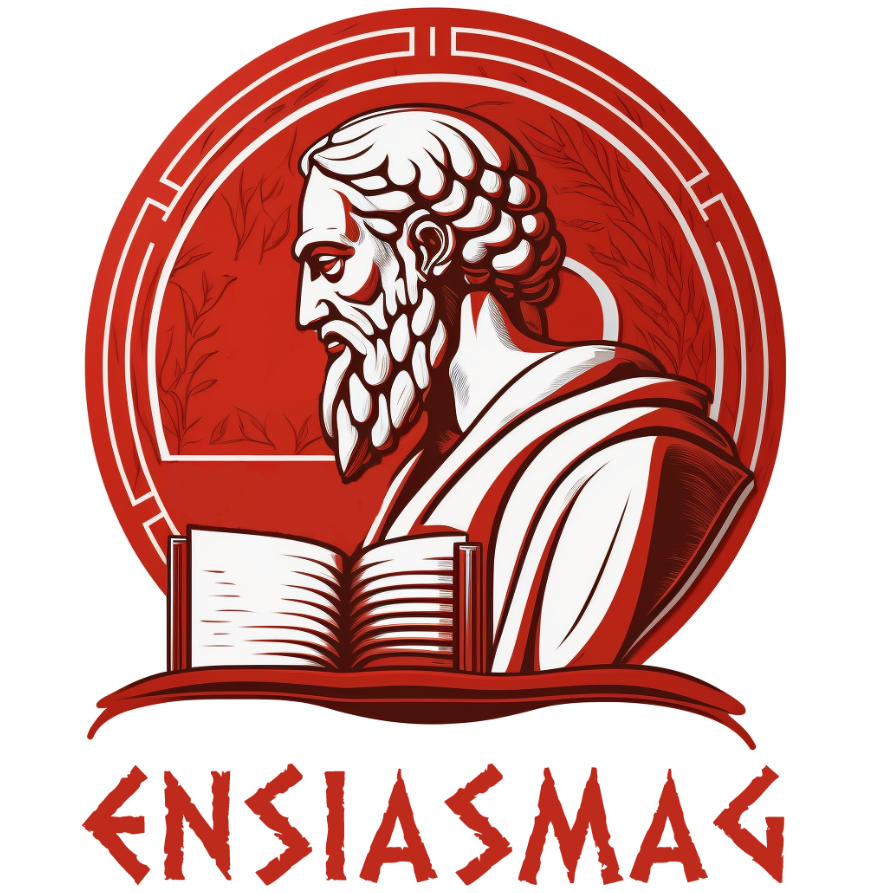

<h2 align="center">
 
 
ENSIAS RSS News
</h2>
 
A static website aggregator of RSS feeds related to ENSIAS news.

This is based on the template repository for <a href="https://github.com/exaroth/liveboat">Liveboat</a> feed generator, used to configure and deploy ENSIAS feed websites on Github Pages.

## License
Liveboat is provided under MIT License, see `LICENSE` file for details
